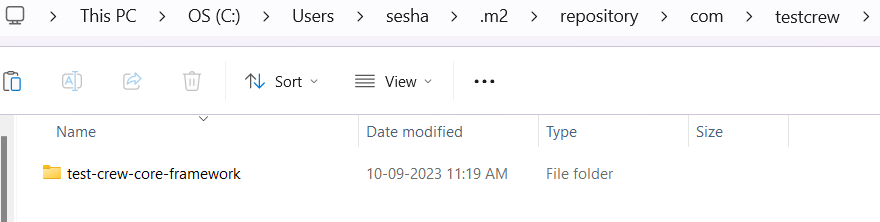
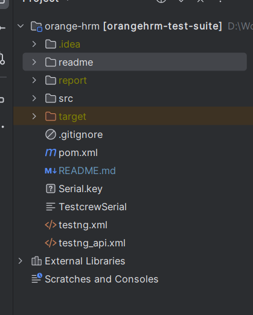
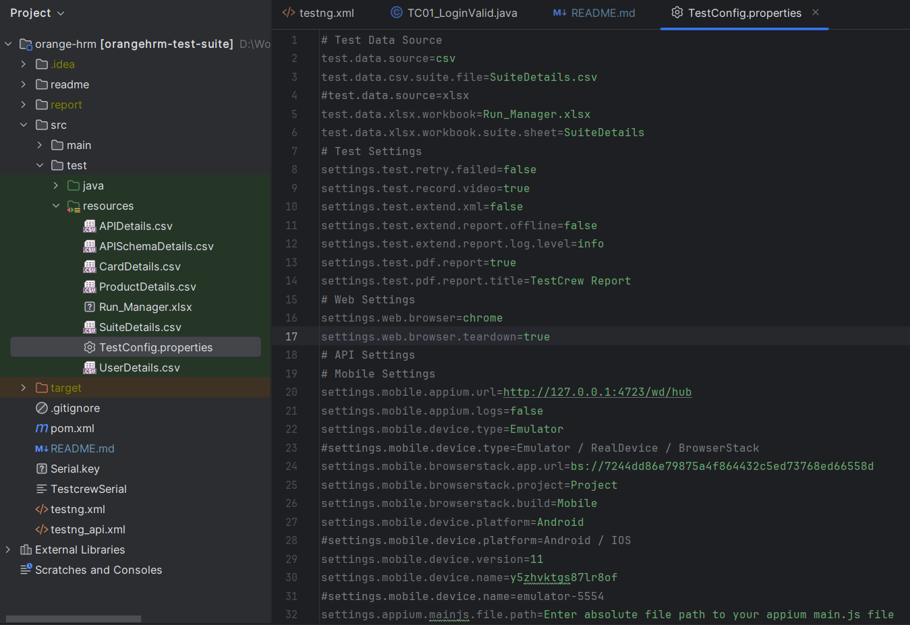
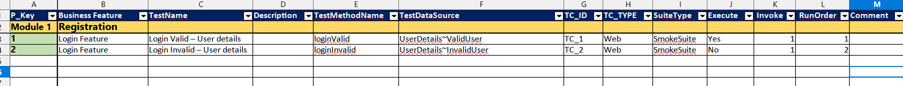
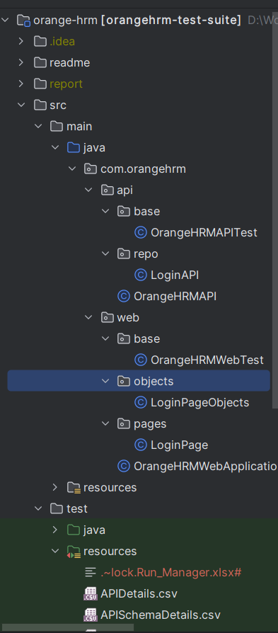
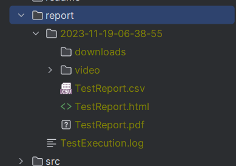

# Test Automation Suite Powered by TestCrew

Project description

## Table of Contents

- [Project Overview](#project-overview)
- [Getting Started](#getting-started)
    - [Prerequisites](#prerequisites)
    - [Installation](#installation)
- [Usage](#usage)
- [Project Structure](#project-structure)
- [Running Tests](#running-tests)
- [Reporting](#reporting)

## Update (v1.0 -> v2.0)

- Nafath login is implemented in the lastest release

## Project Overview

- Java based project for test automation
- Addresses functional, end to end - UI, API & Mobile testing.
- The framework uses **Selenium** with **TestNG** adheres to **Page object model** design pattern.
- **Extent reporter**,**PDF reporter**,**CSV reporter** as a reporting tool
- Video Recording of UI Test execution is supported.

## Getting Started

- To Get Started with the Test Automation Project, Follow the Steps below

### Prerequisites

- Below tools are common for Web & Mobile
    - Java 20
    - Maven (latest version)
    - IntelliJ IDE (latest version)

- Other tools required for mobile
    - Android Studio (latest version)
    - Setup android emulator to execute testcases on emulator
    - Appium (latest version)
    - Appium-doctor (to check if the required setup for running android / ios testcase is complete or not)
    - Nodejs

### Installation

- Place test-crew-core-framework m2 package in .m2 folder.
  

- Checkout the Client Test automation Project from Version Management System (GitLab / TFS / Github)

  

- Do Maven Update & Ensure No Error in Project & all Dependencies associated as shown above.

## Usage

- To Run Test
    - Set TestConfig.properties the browser version, RunManager fileName & Other Necessary config settings.
      
    - Open Run Manager Workbook SuiteDetails Sheet & Mark the Test to be executed as Yes
      

## Project Structure

- Project is Well organised following the Page Object Model.
    - 

## Running Tests

- Execute a suite using IDE:
    - Open the IDE (eclipse), on root folder you will find a xml named testng.xml.
    - Right click -> Run as -> TestNG suite: If this option is not available that means you have to install testNG on to
      your IDE(google for solution).

## Reporting

- Once the execution is completed, the reports will be created under reports folder on the project root Open this on any browser to view it.
    - 
